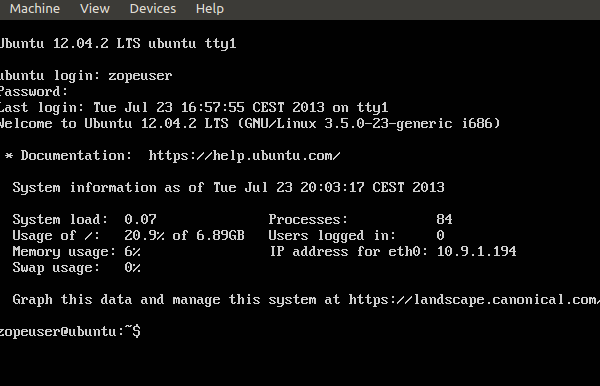

=========
Changelog
=========

Overview about latest changes

.. contents:: :local:

Changelog-25-07-2013
--------------------

Image: identidade-ubuntu-1.2a.ova

- update buildout with latest changes
- change nginx.conf::

    ...
    worker_processes 8;
    ...
    worker_connections 1024;
    use epoll;
    multi_accept on;
    ...
    types_hash_max_size 2048;
    ...

- add to nginx.conf::

    client_max_body_size 50M;
    reset_timedout_connection on;
    client_body_timeout 10;
    send_timeout 2;

- enable gzip cache in nginx.conf

Changelog-24-07-2013
--------------------

Image: identidade-ubuntu-1.1a.ova

- change user to plonegovbr
- kernel upgrade to 3.5.0-36

Known Issues
~~~~~~~~~~~~

- If you run VirtualBox on a older machine with less CPU and Ram, the login

will not show, CPU, RAM and IP

- If you run VirtualBox on a older machine with less CPU and Ram, it is slow for multiple connections

Changelog-23-07-2013
--------------------

Image: plonegovbr_22july2013
Image: identidade-ubuntu-1.0a.ova

- update system packages
- new buildout
- update :doc:`../todo/index` todo list

Changelog-21-06-2013
--------------------

- installed zerofree

Changelog-20-06-2013
--------------------

- fix nginx vhost config -> see nginx section of documentation

Changelog-16-06-2013
---------------------

- switch to ubuntu-minimal

Changelog-09-06-2013
--------------------

Image: ubuntu-plonegov-09062013

- update system packages::

    apport bash-completion isc-dhcp-client isc-dhcp-common libcups2
    libcupsimage2 libgnutls26 libplymouth2 libtiff4 libx11-6 libx11-data
    libxcb-render0 libxcb-shm0 libxcb1 libxext6 libxrender1
    linux-generic-lts-quantal linux-libc-dev nginx nginx-common nginx-full
    plymouth plymouth-theme-ubuntu-text python-apport python-apt
    python-apt-common python-problem-report rsyslog
