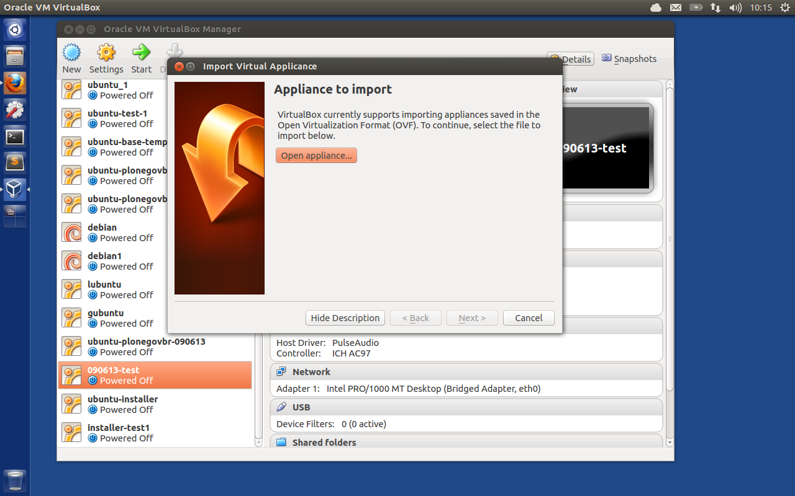
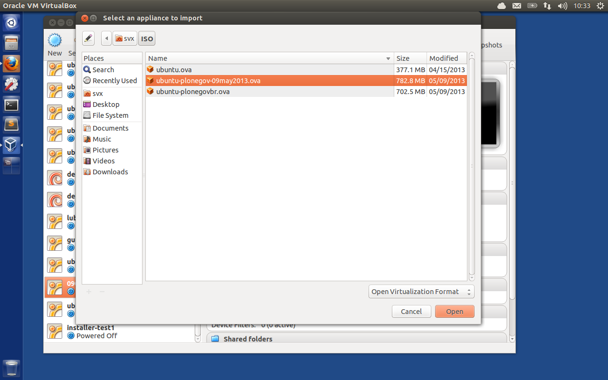
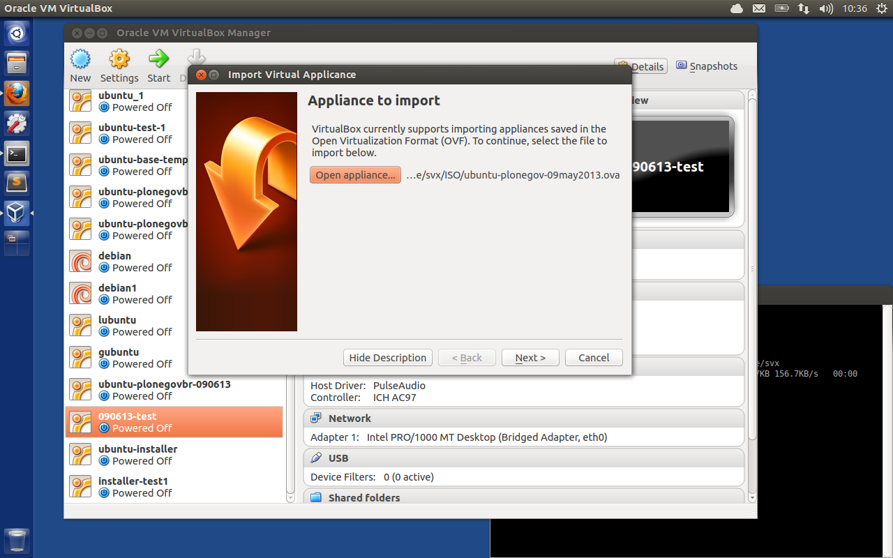
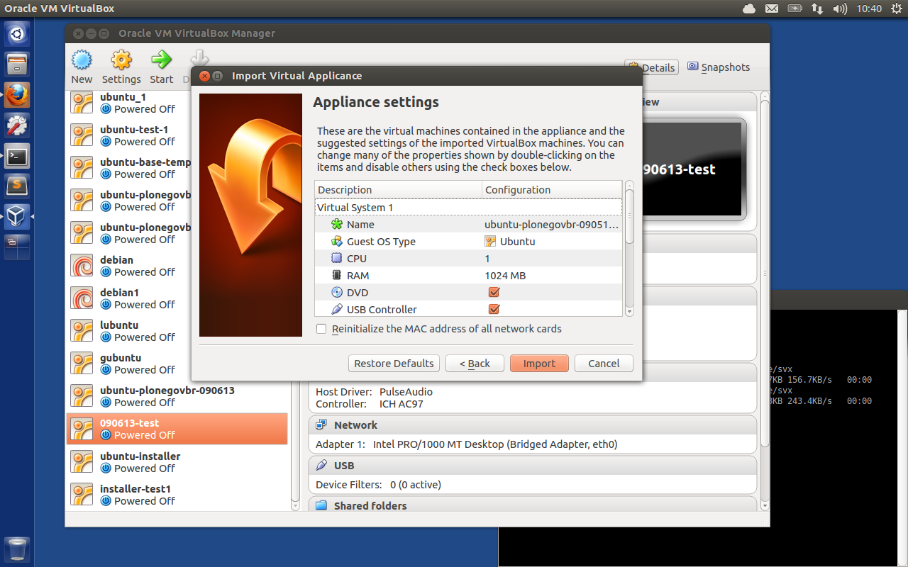
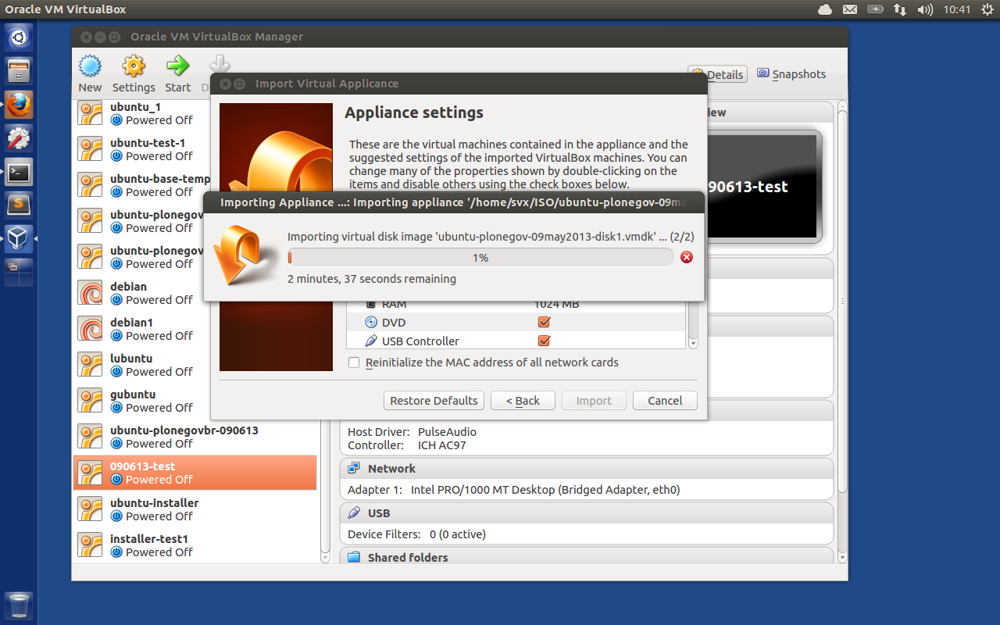
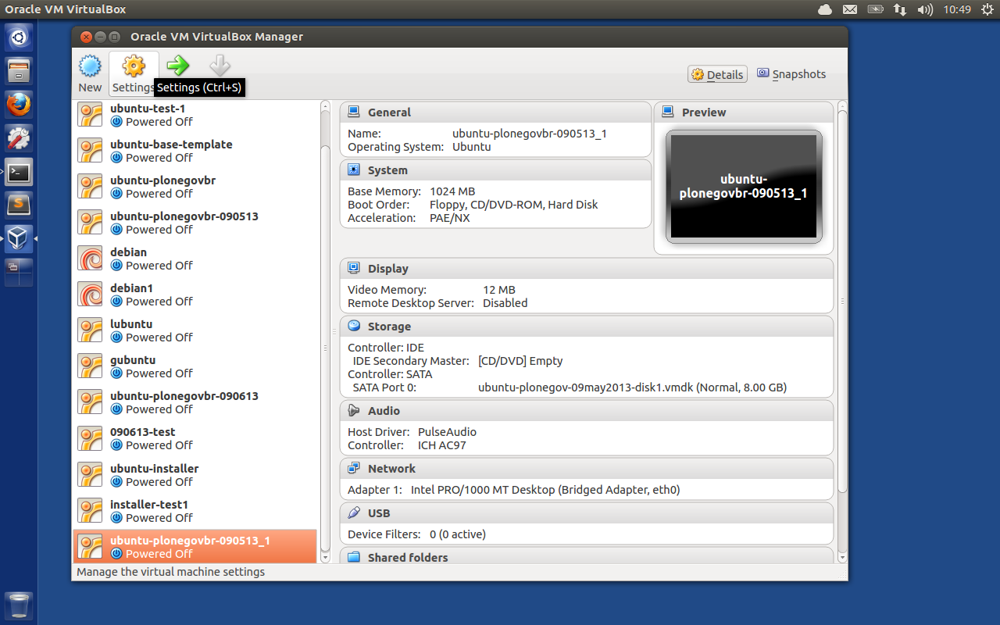
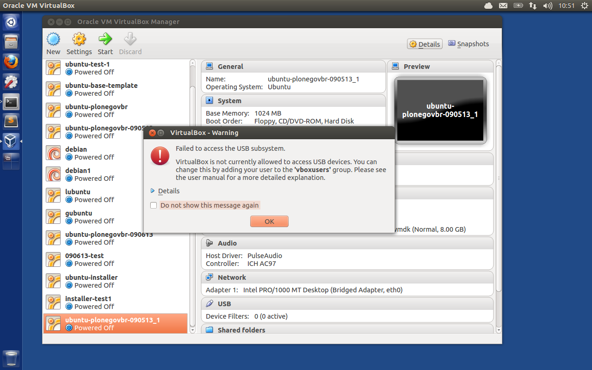
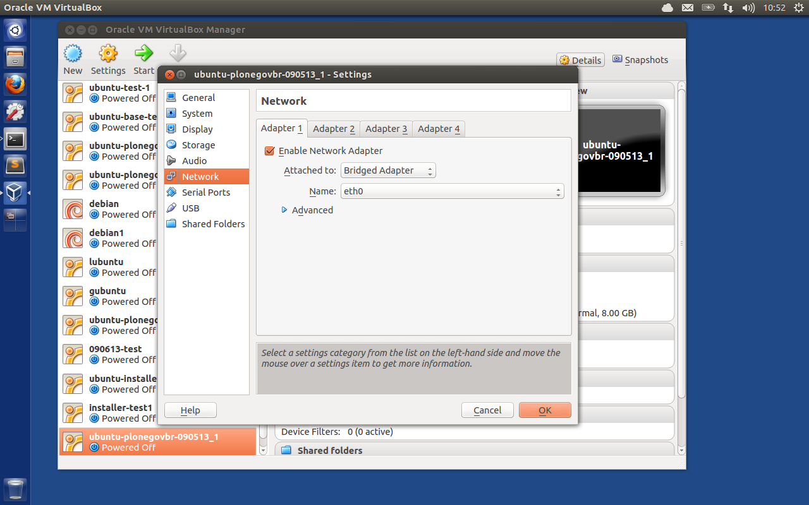

==========
VirtualBox
==========

.. contents:: :local:

How to use this image with `VirtualBox`_, we use `Ubuntu`_ as example.

Install
--------

To get started, press **Ctrl – Alt – T** on your keyboard to open the terminal.
When it opens run the commands below to add the repository key.::

    wget -q http://download.virtualbox.org/virtualbox/debian/oracle_vbox.asc -O- | sudo apt-key add -

Next, run the commands below to add VirtualBox office repository to your
system.::

    sudo sh -c 'echo "deb http://download.virtualbox.org/virtualbox/debian $(lsb_release -sc) contrib" >> /etc/apt/sources.list'

Finally, run the commands below to update your system and install VirtualBox::

    sudo apt-get update && sudo apt-get install virtualbox-4.2

Now you are good to go !

Import
-------

Lets import the image, click on **File** -> **Import Appliance**

Click **Open appliance** and navigate to the already downloaded image

Click **open** again

Click **Next**

Click **Import**

Wait till import is done [coffee yeah !]

Now choose the appliance image, click on start and hopefully the fresh imported image will boot.

Troubleshooting
----------------

Sometimes [depeding on your setup] the image will boot, but networking is not working, if that is the case, choose the image on the left and click on **Settings**

If you get a waring [Failed to access the USB susystem] just ignore it and click om **OK**

In the next menu choose **Network**

Disable and/or Enable here the right Network Adapeter

.. _VirtualBox: https://www.virtualbox.org/
.. _Ubuntu: http://www.ubuntu.com/

